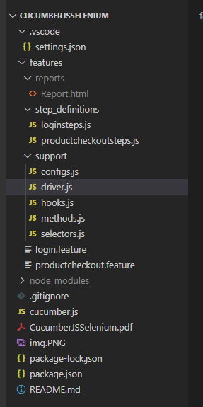

# CucumberJSSelenium
This repo has the code which implements a Selenium Test framework using BDD (Cucumber.js) and JavaScript for the website, https://www.saucedemo.com/

Project setup guide is available in the PDF doc [CucumberJSSelenium.pdf](CucumberJSSelenium.pdf)

### **Folder Structure**

